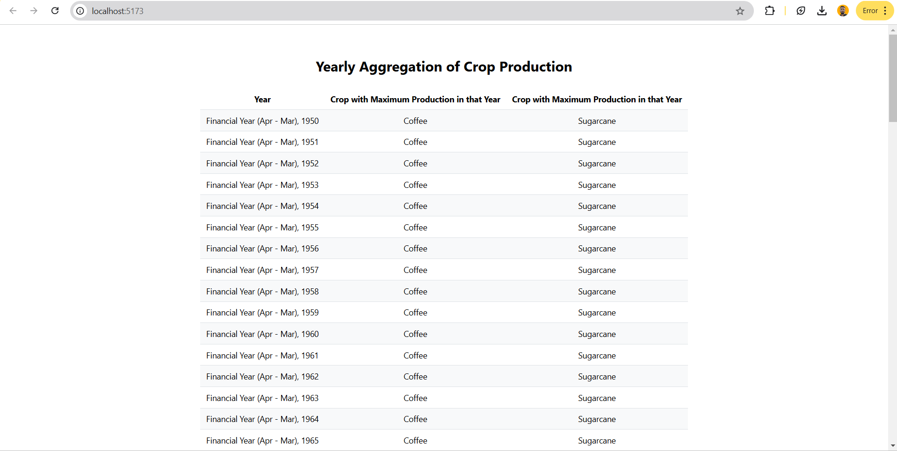
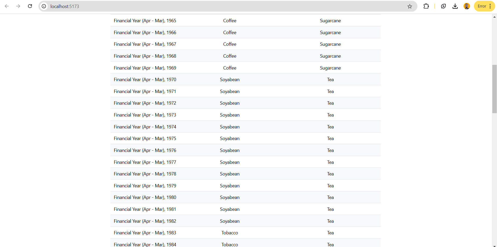
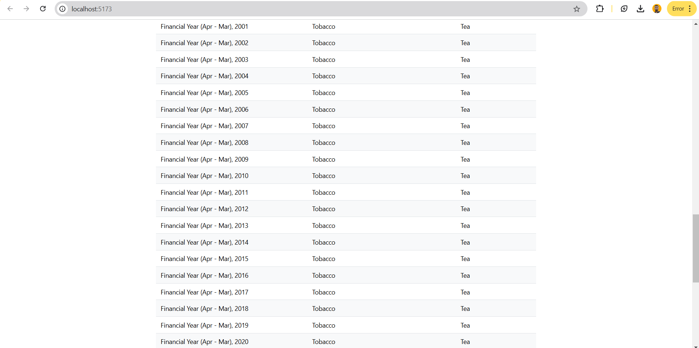
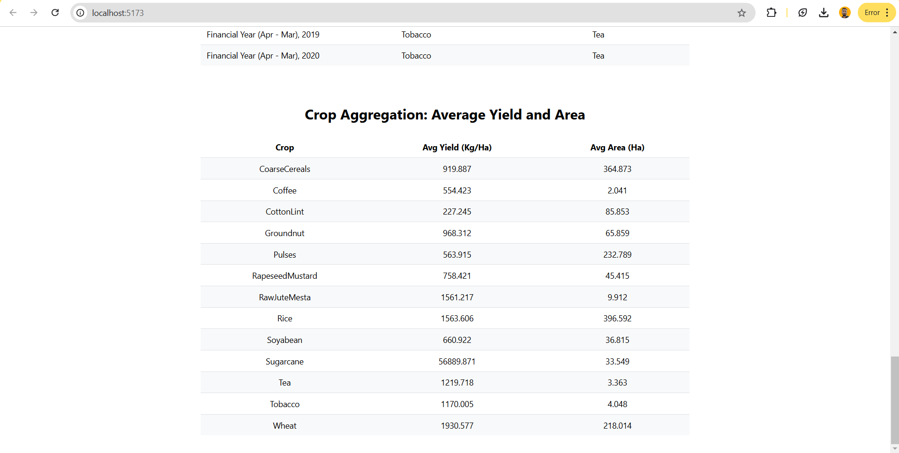

# Analytics

Analytics on the Indian Agriculture Dataset and Results Displayed in Two Tables

* Aggregated Crop Data
* Average Aggregated Crop Data

## How to Run the Project

1. Clone the Repository:
```
git clone https://github.com/dhanraj-hake/analytics-task.git
```

```
cd analytics-task
```


2. Install Dependencies:
```
yarn install
```

3. Run the FastAPI Development Server:
```
yarn dev
```


- The app will be running at http://localhost:5173/


## Screenshots

### Screenshot 1


### Screenshot 2


### Screenshot 3


### Screenshot 4

